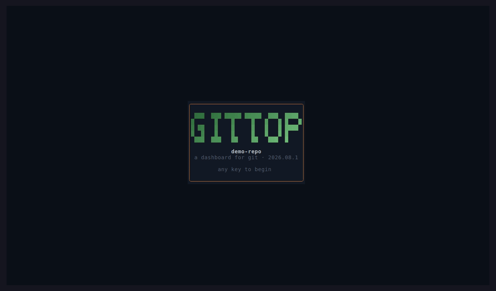

<div align="center">


# gittop

**A btop-style terminal dashboard for Git and CI.**

<p>
  
  
  
  
  
  
  
</p>



</div>

---

## About gittop

Most Git tooling makes you choose. A TUI like lazygit shows you the repo but knows nothing about
your pipeline. The GitHub web UI shows you the pipeline but pulls you out of the terminal. gittop
puts both in one screen: working tree state on the left, commit history and activity graphs in the
middle, CI runs and open pull requests on the right.

The local half works with no network. libgit2 reads the repo directly, so staging a file or writing
a commit does not shell out to `git` or depend on its output format. The remote half talks to the
GitHub and GitLab REST APIs and degrades to the local view when there is no token, no remote, or no
connection.

## Installing

Download the latest [release](https://github.com/sinhaparth5/gittop/releases).

```bash
sudo dpkg -i gittop_*_amd64.deb        # Ubuntu 22.04+, Debian 12+
```

Or the portable tarball for any other distribution — unpack it and put `bin/gittop` on your `PATH`:

```bash
tar xzf gittop-*-linux-x86_64.tar.gz
```

Both carry the icon and a desktop entry, so gittop shows up in application menus as well as on the
command line. To build it yourself instead, see [Building it](#building-it).

**Windows:** run gittop under WSL and install the `.deb` there. There is no native Windows build —
the ssh passphrase channel, the browser opener and the `0600` config permissions are POSIX, so a
port is real work rather than a second build target. gittop already knows it is under WSL: it opens
browsers with `wslview` and detects Windows Terminal's colour support.

## What works today

Ten views, switched with `1` through `9` and `0`, or cycled with `tab`.

**Status.**

- Status cards for staged, unstaged, untracked, and conflicted counts, with gradient fill bars
  that ease to their new value when something changes
- A file list grouped by state, with the directory dimmed and the filename bright so long lists
  scan by name
- Stage and unstage per file (`space`, or `s` and `u`), or stage everything with `a`
- Discard, behind a confirm dialog. Tracked files restore from the index, matching `git restore`;
  untracked files are deleted, and the dialog says which of the two is about to happen
- Commit from an overlay

Status is conveyed by glyph and letter as well as color, so a row reads correctly without being
able to separate green from amber.

**History.**

- Commit log with a box-drawing lane graph, branch and tag badges, author, and relative age
- A 91-day activity heatmap, 13 weeks across by weekday down
- HEAD marked distinctly from every other commit

**Branches.**

- Local branches with ahead/behind counts against their upstream, checked-out branch first
- A branch whose upstream was deleted on the remote reads `gone` rather than a count against a
  ref that no longer describes anything, and `x` prunes the tracking refs that have gone stale

**Graph.**

- A braille area chart of commits over the whole history, gradient filled with a bright crest
- Pan through time with `h` and `l`, jump to either end with `g` and `G`
- Switch granularity between day, week, and month with `d`, `w`, and `m`
- A scroll handle shows where the visible window sits in the full timeline
- Top authors, weekday distribution, and a commits-by-hour sparkline in the author's own timezone

**Diff.**

- The unstaged diff, the staged diff, or any commit's, with old and new line numbers side by side
- `enter` on a file in the status view opens that file's diff; `enter` on a commit in the history
  view opens that commit's, against its first parent
- `s` swaps between the unstaged and staged halves; `[` and `]` jump between files
- Per-file additions and deletions on the banner, and a total in the header
- A new file shows its contents rather than announcing that a file appeared and stopping there;
  a binary file is named rather than dumped; a rename is drawn as a rename
- Capped at 20,000 lines, and it says where it stopped rather than trailing off

**Stashes.**

- `S` puts the whole working tree away, untracked files included — a "clean" tree with new files
  still in it is not what anyone means by stashing their work
- The list shows each entry's index, the branch it came from, its subject and its age
- `a` applies and keeps the entry, `p` pops and `d` drops, the last two behind a confirm
- Apply and pop stop rather than write over an uncommitted edit, naming the file in the way, and
  pop keeps the entry when it cannot apply cleanly

**Rebase and interrupted work.**

- `B` rebases the current branch onto its upstream, behind a confirm. It refuses on a dirty tree
  rather than stashing behind your back
- A merge, rebase, cherry-pick, revert or bisect left half-finished gets a banner above the file
  list saying which it is and, for a rebase, how far through
- `o` opens it: continue, or abort. Both go through a second confirm, so neither is one keystroke
- Continue commits what is staged and carries on to the next conflict; abort puts the branch back
  exactly where it started
- Committing during a merge writes every parent and clears the merge state, which is the part
  that is easy to get silently wrong

**Filtering.**

- `/` narrows whichever list is on screen — files, commits, branches, stashes, CI runs, pulls
- The box counts matches as you type, so a query that matches nothing says so before you finish
  the word rather than showing you a blank list
- `enter` keeps it and `esc` clears it; the footer keeps showing it, because a list hiding nine
  rows out of ten and a list with one row in it look identical otherwise

**Remote.**

- Reads the repository from GitHub or GitLab: description, default branch, visibility, last push
- Stars, forks, open issues, and watchers
- Remaining API budget as a bar, so you can see a throttle coming rather than hit it
- Works anonymously on public repositories; a token raises the limit and opens private ones
- Self-hosted GitHub Enterprise and GitLab are detected from the hostname, and a host that gives
  nothing away can be named in the config
- More than one remote: `R` walks them, and every remote-backed view follows

**CI.**

- Workflow runs from GitHub Actions and pipelines from GitLab CI, for the branch you are on
- Passed, failed, running, queued, manual, cancelled and skipped, each with its own glyph and word
  as well as its own colour
- Duration per run, counting up while one is still going, and how long ago it started
- `enter` opens the jobs of the selected run — with GitLab's stages when there are stages
- Refreshes on a timer while the view is open, and says in the header when the next one is due

**Pull requests.**

- Open pull requests from GitHub and merge requests from GitLab, in one list that says what each
  provider actually reports rather than inventing the rest
- Draft, open, merged and closed, each with its own glyph and word
- `enter` opens the branches, author, labels, reviewers and URL — a disclosure, not a request:
  everything it shows arrived with the list, so scrolling with it open costs nothing
- Mergeable, conflicting and blocked where GitLab says so; GitHub's list endpoint does not report
  mergeability, so that column simply is not drawn rather than guessed at
- The one for the branch you are standing on is marked and sorted to the top

**Settings.**

- One page, on `0`, for the things that used to be a key you had to know about or a file you had to
  edit: theme, glyph set, panel border, colour depth, animations, compact layout, the startup card
- `enter` changes the row under the cursor — the mouse does the same with a second click on a row
- Connect a GitHub or GitLab account, or sign out of one, without leaving the dashboard
- Switch which remote the network views read, when a repository has more than one
- A read-only sidecar naming the repository, its remotes with any credentials stripped out of the
  URLs, and where the config file is
- Changes take effect the moment you make them and are written only when you ask, from the row that
  says so. Saving regenerates the file, so a hand-written config would otherwise lose its comments
  to a keystroke you pressed to look at a theme
- A row that cannot be changed from here says why where its verb would have gone. A token in the
  environment beats everything, so that row names the variable — never the value — and says the
  environment wins

## Signing in

`L` anywhere, or the connection row on the settings page. Two routes into one overlay, and which
one you get is not a preference:

- Where the host has an OAuth application configured, the **device flow**: gittop shows a URL and a
  short code, opens your browser, and waits. It is the only OAuth flow that needs no loopback
  server and no open port, which is also what makes it work over ssh.
- Everywhere else, a **guided personal access token**: a deep link to the provider's token page
  with the name and the scopes already filled in, and a password field to paste the result into.
  This is not a degraded mode — no `client_id` ships with gittop, because a device-flow id binds a
  build to one registered application and that is a packaging decision, so today this is the route
  every host takes. Set `hosts."<host>".client_id` to get the other one.

The token is written to the config file at `0600` in a `0700` directory. An environment variable
still beats it, so CI never needs anything on disk; a sign-in that could not be saved keeps working
for the session and says on screen that it will not survive a restart. There is no code path that
prints a token, masked or otherwise.

The refresh loop is built around the rate limit rather than a stopwatch. It only runs while the CI
view is on screen, only when there is a token — sixty anonymous requests an hour does not survive a
twenty-second poll — and it stops on its own below a fifth of the remaining budget. Every one of
those cases says why in the header instead of quietly going still. Jobs are read when you ask for
them rather than for every row, so scrolling a list of runs costs nothing.

The fetch runs on a worker thread. The dashboard keeps drawing while it is in flight, and quitting
mid-request does not wait for it. Every failure has its own screen: a rejected token says which
variable or file it came from, a 404 while anonymous points out that private repositories need
one, and no network at all is reported as the ordinary thing it is.

The layout adapts: stat cards stack two-by-two below 84 columns, the heatmap yields to the log
on terminals shorter than 30 rows, and the remote view folds its count tiles into a single line
when there is no room for four.

## Push and pull

`f` fetches, `p` pulls, `P` pushes. All three run on a worker thread with a progress bar, and
`esc` gives up on one mid-flight.

Pull fast-forwards or refuses. A branch that has diverged needs a merge commit or a
rebase, and doing either implicitly behind a key called "pull" is how a tool loses work that
exists nowhere else — so gittop fetches, says what it found, and leaves the decision alone. A
fast-forward that would write over an uncommitted change stops and names the file in the way.

Push never forces, and there is no flag to make it. It asks before it runs, because it is the only
thing here that changes something other people can see. A branch with no upstream gets one, the
same as `git push -u`.

Over https, a token from the environment or the config file is the password. Over ssh, gittop runs
the `ssh` you already have — so your `~/.ssh/config`, your agent, your keys and your known_hosts
all apply, and a remote that works from the shell works here with nothing else to set up.

## Themes

Eight built in: `default`, `catppuccin`, `gruvbox`, `nord`, `tokyo-night`, `dracula`, `daylight`
— a light theme designed as one rather than a dark theme inverted — and `accessible`. `t` cycles
them, and the settings page picks one from a list and keeps it.

A theme of your own is still a file, because there is no sensible way to type sixteen colours into
a terminal row. Palettes are written in sixteen roles, so yours is those same roles under
`[theme.colors]` — anything you leave out keeps the value it had.

Colour degrades on the way to the screen rather than in the panels: truecolor when `COLORTERM`
says so, the 256-colour cube when `TERM` does, the base sixteen otherwise, and none at all under
`NO_COLOR`. Every status in gittop is a glyph and a letter as well as a colour, so the monochrome
case is legible rather than merely supported. The settings page shows what was detected and lets
you pin it, which is the quickest way to find out that a terminal has been lying about its depth.

**On `accessible`.** The seven curated palettes were measured against a dichromat simulation, and
most of them put staged and conflicted on colours that are indistinguishable to someone with
deuteranopia — 0.8 ΔE apart in the default theme, which is to say the same colour. Those are
Catppuccin's and Gruvbox's real published colours and retuning them would make them not those
themes, and gittop stays readable regardless because of the glyph-and-letter rule above. But if you
would rather the colour worked than merely be redundant, `accessible` moves the four states off the
red/green axis onto blue and amber: worst case 36.6 ΔE across normal vision, deuteranopia,
protanopia and tritanopia.

## Glyphs, borders and motion

All four of these are rows on the settings page — glyph set, panel border, animations and the
startup card — and they change as you press them. The file is what they are saved to, not how you
reach them:

```toml
[theme]
icons = "auto"        # auto, ascii, unicode, nerd
logos = false         # the real GitHub and GitLab marks; needs a Nerd Font
border = "rounded"    # rounded, light, heavy, double
animations = true
splash = true
```

Every character gittop draws comes from a named role, the same way every colour does, so switching
sets is one line rather than a patch. `auto` picks `ascii` when the locale is not UTF-8 or `TERM`
says the terminal has no shapes, and `unicode` otherwise. It never picks `nerd`: there is no way to
ask a terminal whether its font has the private-use icons, and guessing wrong fills the screen with
empty boxes — so that one is yours to turn on.

`logos` is that opt-in narrowed to the two glyphs most worth it. The GitHub and GitLab marks go in
front of the provider's name everywhere it appears — the remote panel, the CI header, the pull list,
the sign-in pane, and the settings page's remote row and remotes card — and with `logos = true` they
are drawn as the real octocat and tanuki from a Nerd Font while the rest of the interface stays on
whatever `icons` chose. A hexagon is not a logo; a `✓`, on the other hand, is a perfectly good check.

Text is measured in terminal cells rather than bytes, so a Japanese commit message or an emoji in a
filename is truncated with an ellipsis at the right column instead of tearing the panel border.

`animations = false` makes the eased bars, the spinners, the toast fade and the splash snap to their
final state rather than disappear — nothing on screen is lost, only the movement. With animations
on, the frame rate is capped at 30 and only ever on frames the animation itself asked for, so a
keystroke is never held up behind a progress bar. An idle dashboard requests no frames at all.

## Keys and the mouse

Every key is rebindable under `[keys]` in the config, by action name rather than by position, and
the footer hints and the help overlay read the bindings in force rather than a list of what they
used to be.

The mouse works too: the wheel scrolls, a click selects a row or switches to a tab, and clicking
the row already under the cursor opens it.

## Custom layouts

`[layout]` decides which tabs exist and in what order:

```toml
[layout]
views = "status diff history branches stashes"
start_view = "status"
compact = false
```

Any view left out is simply not there — a reasonable thing to want on a repository with no remote
worth watching. The digit keys are positional, so `2` reaches whatever you put second and the tab
prints the same number; there is no way for a tab to advertise a key that goes somewhere else.
`compact` forces the narrow layout at any width, which gittop otherwise switches to under 84
columns on its own; that one is also a row on the settings page. Which tabs exist stays in the file
— it is a decision you make once, not one you want a keystroke away from.

## Tokens

Public repositories need no token. GitHub allows 60 anonymous requests an hour; a token raises
that to 5000 and lets gittop read private repositories.

The environment is checked first, so a shell or a CI job never has to write a secret to disk:

```bash
export GITHUB_TOKEN=ghp_...      # or GH_TOKEN, or GITTOP_TOKEN for either provider
export GITLAB_TOKEN=glpat-...    # or CI_JOB_TOKEN
```

Otherwise the token lives in `~/.config/gittop/config.toml`, which gittop creates `0600`. Signing
in with `L` writes it for you, so the usual way to get a token on disk is to press a key rather than
to open an editor.

```bash
gittop --init-config    # writes a commented starter
gittop --config-path    # prints where it looks
```

A token is never printed back to you, masked or otherwise. The remote panel names the variable or
the file it came from and nothing else.

## What is not here yet

Staging a hunk rather than a whole file. Interactive rebase with reword, squash, drop and reorder
— `B` today is `rebase @{upstream}` and nothing else. Merge, so a pull that is not a fast-forward
has an option besides rebasing. More than one page of CI and pull request history. Opening a pull
request, rather than only reading one.

[Open issues](https://github.com/sinhaparth5/gittop/issues) track these and are the current list;
[`progress.md`](progress.md) has the stack decisions, the source layout and the work log behind
them.

## Keys

| Key               | Action                                                               |
| ----------------- | -------------------------------------------------------------------- |
| `1` … `9` `0`     | Jump to a tab by its number                                          |
| `tab`             | Cycle through the views                                              |
| `j` `k` or arrows | Move the selection                                                   |
| `g` `G`           | First / last, or oldest / newest on the graph                        |
| `ctrl-u` `ctrl-d` | Move a screen at a time                                              |
| `/`               | Filter the list on screen; `esc` clears it                           |
| `enter`           | Diff a file or a commit, jobs of a CI run, details of a pull request |
| `h` `l`           | Pan the graph through time                                           |
| `d` `w` `m`       | Graph bucket: day, week, month                                       |
| `space`           | Stage or unstage the selection                                       |
| `s` `u`           | Stage / unstage explicitly                                           |
| `a`               | Stage everything                                                     |
| `d`               | Discard the selection, after a confirm                               |
| `c`               | Write a commit                                                       |
| `s`               | Diff view: swap between unstaged and staged                          |
| `[` `]`           | Diff view: previous / next file                                      |
| `S`               | Stash the whole working tree                                         |
| `a` `p` `d`       | Stash view: apply / pop / drop, the last two after a confirm         |
| `B`               | Rebase this branch onto its upstream, after a confirm                |
| `o`               | Continue or abort a rebase, merge or cherry-pick                     |
| `f` `p` `P`       | Fetch / pull / push                                                  |
| `x`               | Branches view: prune remote-tracking refs, after a confirm           |
| `R`               | Switch to the next remote                                            |
| `L`               | Sign in to GitHub or GitLab                                          |
| `t`               | Next theme                                                           |
| `r`               | Re-read the repository, or re-fetch on the remote views              |
| `?`               | Help                                                                 |
| `q`               | Quit                                                                 |

Keys that appear twice are scoped to a view: `s` stages on the status view and swaps sides on the
diff view, `d` discards, changes the graph bucket, and drops a stash. Which one a key means is a
fact about where you are, not something the config decides.

## Building it

C++20, drawn with [FTXUI](https://github.com/ArthurSonzogni/FTXUI), reading Git through
[libgit2](https://libgit2.org/), talking to the providers over [libcurl](https://curl.se/libcurl/)
and [nlohmann/json](https://github.com/nlohmann/json).

Needs a C++20 compiler, CMake 3.24 or newer, zlib, and libcurl. The other three are fetched and
built by CMake.

```bash
sudo apt install libcurl4-openssl-dev     # or libcurl-devel, or curl on Homebrew

cmake -B build -DCMAKE_BUILD_TYPE=Release
cmake --build build -j
./build/gittop            # reads the repository containing the current directory
./build/gittop /some/repo # or one you name
```

The first configure downloads the fetched dependencies, so it takes a few minutes. After that,
builds are quick.

libcurl is the one dependency taken from the system rather than built here, because the
distribution's copy comes configured for the platform's CA bundle and TLS backend. A vendored one
would have to be told where the machine keeps its certificates before it could verify a request.

libgit2's transports are on, and neither costs a build dependency. HTTPS uses libgit2's
`OpenSSL-Dynamic` backend, which loads libssl at run time rather than linking it, so no OpenSSL
headers are needed to build and the binary is not tied to the version it compiled against. SSH
runs the system `ssh` instead of libssh2 — cheaper to build, and better behaved, since it inherits
your own ssh configuration.

## License

GPL-3.0. See [LICENSE](LICENSE).
